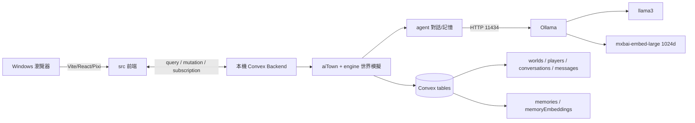

# 專案位置、架構與維護手冊

## 維護者快速索引

| 項目 | 位置 | 說明 |
|---|---|---|
| NPC 資料、人格、對話目標 | `data/characters.ts` | V0 不修改 |
| NPC Sprite metadata | `data/spritesheets/*.ts` | Pixi spritesheet 定義 |
| NPC Sprite 圖片 | `public/assets/spritesheets/` | 原始角色圖片資產 |
| 現行都市地圖資料 | `data/taiwanCity.ts` | 48×32 格、背景與碰撞規則，由 `convex/init.ts` 載入 |
| 現行都市地圖美術 | `public/assets/taiwan-city-map-v1.png` | 1536×1024 像素背景圖磚集 |
| 原版森林地圖 | `data/gentle.js`、`public/assets/gentle-obj.png` | 保留供還原與比較 |
| 地圖轉換工具 | `data/convertMap.js` | 將 Tiled JSON 轉成專案格式 |
| 記憶流程 | `convex/agent/memory.ts` | 摘要、重要度、向量搜尋、反思 |
| 記憶 schema | `convex/agent/schema.ts` | `memories`、`memoryEmbeddings` |
| 對話生成 | `convex/agent/conversation.ts` | prompt、歷史與記憶注入 |
| AI 模型/provider | `convex/util/llm.ts` | Ollama/OpenAI/Replicate 與預設模型 |
| 世界初始化 | `convex/init.ts` | 建立地圖、角色與預設世界 |
| 世界模擬 | `convex/aiTown/`、`convex/engine/` | agent 行為、路徑與 simulation engine |
| 前端 | `src/` | React、Pixi 地圖與聊天介面 |

## 系統架構

前端不直接呼叫模型。Convex action 組合對話上下文並呼叫 Ollama；simulation engine 保存世界狀態；對話結束後建立摘要與 embedding，寫入記憶表供後續向量檢索。

## API 與模組邊界

- 前端 API：`convex/_generated/api.*` 的型別安全 client。
- 世界讀取：`convex/world.ts`。
- 玩家與對話：`convex/players.ts`、`convex/messages.ts`、`convex/aiTown/*`。
- 初始化與維護：`convex/init.ts`、`convex/testing.ts`。
- 模型 HTTP：Ollama `/api/generate` 與 `/api/embeddings`，封裝在 `convex/util/llm.ts`。

V0 沒有新增或修改 public API。未來若與 TD/RPG 共用世界觀，應新增明確的 domain adapter，不要讓另一款遊戲直接讀寫 AI Town 內部 tables。

## 權限、安全與部署

- `.env.local` 永不提交；雲端 secrets 使用 `convex env set`。
- 本機匿名 Convex 只供開發，不是 production 身分驗證方案。
- Ollama 僅綁定 loopback，不要無驗證暴露到公網。
- 記憶是 prompt 的不可信歷史資料；後續修改不得移除此安全界線。
- V0 不是 production 發佈。正式部署另需 production Convex、authentication、模型限流、資料政策、監控、備份演練與 HTTPS。
